# Phase 1 — Architecture & CI/CD

**Status:** draft for review. Nothing committed per the sprint commit rule.
**Scope:** three repos — `pantrybelt-v3-3` (mobile), `Agency-Dashboard`, `Operator-Portal`.
**Date:** 2026-09-28

---

## 1. System diagram

Every edge below is TLS 1.2+ (Google/Vercel/Firecrawl endpoints are HTTPS-only;
Firestore and Functions use gRPC-over-TLS). TLS is therefore *not* drawn per-edge —
it is a property of the trust boundary crossings marked `══`.

```mermaid
flowchart TB
    %% ─────────────────────────── CLIENTS ───────────────────────────
    subgraph CLIENTS["CLIENTS — all code here is public, assume every string is readable"]
        APP["<b>AccessBelt Mobile</b><br/>Expo SDK 54 · RN 0.81.5 · React 19<br/>com.accessbelt.app<br/><i>anonymous-by-default</i>"]
        AD["<b>Agency Dashboard</b><br/>Vite + React · Recharts · d3-geo<br/>Vercel · read-mostly analytics"]
        OP["<b>Operator Portal</b><br/>Vite + React · Leaflet<br/>Vercel · pantry managers"]
    end

    %% ─────────────────────── IDENTITY / ATTESTATION ───────────────────────
    subgraph IDENT["GOOGLE IDENTITY — clients talk to Google directly, never via our backend"]
        AUTH["<b>Firebase Auth</b><br/>identitytoolkit.googleapis.com<br/>• anonymous sign-in<br/>• email/password upgrade via linkWithCredential<br/>• custom claims: role · orgId · counties"]
        AC["<b>Firebase App Check</b> 🔒<br/>App Attest · Play Integrity · reCAPTCHA v3<br/><i>Phase 2 — monitor-only, then enforce</i>"]
    end

    APP ==>|"sign-in / token refresh<br/>no backend hop"| AUTH
    AD  ==>|"email+password sign-in"| AUTH
    OP  ==>|"email+password sign-in"| AUTH
    APP -.->|"mints attestation token"| AC
    AD  -.->|"reCAPTCHA v3"| AC
    OP  -.->|"reCAPTCHA v3"| AC

    %% ─────────────────────────── DATA ───────────────────────────
    subgraph DATA["FIRESTORE — project pantrybelt-1e7eb · 3 named databases"]
        FSD["<b>(default)</b> 🔒 rules<br/>agencies · user_profiles<br/>_app_sessions · analytics_*<br/>users · organizations · events"]
        FSA["<b>accessbelt-agency</b> 🔒 rules<br/><i>deny-all stub — no schema yet</i>"]
        FSO["<b>accessbelt-operator</b> 🔒 rules<br/>portal-owned collections<br/><i>rules live in Operator-Portal repo</i>"]
    end

    APP ==>|"ID token + App Check token<br/>reads: agencies<br/>writes: own user_profiles, analytics"| FSD
    AD  ==>|"ID token · claims-gated read"| FSA
    AD  ==>|"aggregate reads"| FSD
    OP  ==>|"ID token · claims-gated RW"| FSO
    OP  ==>|"writes resources/events"| FSD

    %% ─────────────────────────── BACKEND ───────────────────────────
    subgraph BACKEND["CLOUD FUNCTIONS v2 — Node 20 · us-central1 · codebase: default"]
        CF1["<b>askPete</b> 🔒<br/>auth check · 🔒 rate limit<br/>PII scrub outbound"]
        CF2["<b>encryptUserField</b> 🔒<br/>auth check · field allowlist"]
        CF3["<b>generatePasswordResetLink</b> 🔒<br/>auth check · 🔒 3/day limit<br/><i>real 10-min flow → Phase 5</i>"]
    end

    APP ==>|"httpsCallable — ID token verified<br/>automatically by onCall"| CF1
    APP ==> CF2
    APP ==> CF3

    %% ───────────────────── SECRETS / CRYPTO ─────────────────────
    subgraph CRYPTO["SECRET & KEY MANAGEMENT — server-side only"]
        SM["<b>GCP Secret Manager</b><br/>GEMINI_API_KEY<br/>KMS_ENCRYPTION_KEY_NAME<br/>RESEND_API_KEY <i>(Phase 5)</i>"]
        KMS["<b>Cloud KMS</b> 🔒<br/><i>field encryption at rest</i><br/>contactEmail only<br/>ZIP stays plaintext → county"]
    end

    CF1 -->|"defineSecret injection<br/>at runtime"| SM
    CF2 --> SM
    CF2 ==>|"encrypt/decrypt<br/>key never leaves KMS"| KMS
    CF2 -->|"writes ciphertext"| FSD
    CF3 -->|"Admin SDK"| AUTH

    %% ─────────────────────── ANALYTICS SINK ───────────────────────
    subgraph ANALYTICS["ANALYTICS — county-level granularity only, per OA §6.5"]
        EXT8["<b>8 × firestore-bigquery-export</b><br/>sessions · searches · search-outcomes<br/>referrals · pantry-engagements<br/>food-deserts · user-counties · monthly-summary"]
        BQ[("<b>BigQuery</b><br/>pantrybelt-1e7eb")]
        CRASH["<b>Crashlytics + Analytics</b><br/>@react-native-firebase 26.4"]
    end

    FSD ==>|"change-stream export"| EXT8
    EXT8 ==> BQ
    APP -->|"crash + event telemetry"| CRASH
    BQ -->|"aggregate reads<br/><i>future</i>"| AD

    %% ─────────────────────── EXTERNAL APIS ───────────────────────
    subgraph EXTAPI["EXTERNAL APIs"]
        GEM["<b>Gemini API</b><br/>gemini-2.0-flash<br/><i>key server-side only</i>"]
        MAPS["<b>Google Maps SDK — Android only</b><br/>restricted: package + SHA-1<br/><i>iOS uses Apple MapKit, no key</i>"]
        CENSUS["<b>US Census Geocoder</b><br/>free · no key · CURRENT PATH"]
        GGEO["<b>Google Geocoding / Places /<br/>Address Validation</b><br/><i>FUTURE — billing not enabled</i>"]
        RESEND["<b>Resend</b><br/><i>FUTURE — Phase 5 email</i>"]
    end

    CF1 ==>|"10s timeout · PII-scrubbed prompt"| GEM
    APP -->|"tile rendering"| MAPS
    CF3 -.->|"Phase 5"| RESEND

    %% ─────────────────────── DEV WORKSTATION ───────────────────────
    subgraph DEV["DEVELOPER WORKSTATION — never shipped, never in CI"]
        TOOLS["<b>tools/ + seed scripts</b><br/>firebase-admin · bypasses ALL rules<br/>serviceAccountKey.json in ~/.config"]
        FC["<b>Firecrawl</b><br/>pantry address scraping"]
    end

    TOOLS ==>|"Admin SDK — no rules applied"| FSD
    TOOLS ==>|"address → lat/lng"| CENSUS
    TOOLS -.->|"if billing enabled"| GGEO
    TOOLS ==> FC

    %% ─────────────────────────── STYLING ───────────────────────────
    classDef client   fill:#e8f0fe,stroke:#1a73e8,stroke-width:2px,color:#0b1f3a
    classDef enforce  fill:#fde8e8,stroke:#c5221f,stroke-width:3px,color:#3a0b0b
    classDef data     fill:#e6f4ea,stroke:#137333,stroke-width:2px,color:#0b2e14
    classDef external fill:#fef7e0,stroke:#b06000,stroke-width:2px,color:#3a2500
    classDef future   fill:#f1f3f4,stroke:#80868b,stroke-width:2px,stroke-dasharray:5 5,color:#3c4043
    classDef devonly  fill:#f3e8fd,stroke:#8430ce,stroke-width:2px,color:#2a0b45

    class APP,AD,OP client
    class AUTH,AC,CF1,CF2,CF3,KMS enforce
    class FSD,FSA,FSO,BQ,EXT8 data
    class GEM,MAPS,CENSUS,CRASH,SM external
    class GGEO,RESEND future
    class TOOLS,FC devonly
```



**Legend:** 🔒 = an enforcement point. `══` = a trust-boundary crossing.
`- - ->` = not yet built / not yet enabled.

---

## 2. Where each control actually sits

| Control | Enforcement point | Status |
|---|---|---|
| **TLS 1.2+** | Terminated by Google Front End / Vercel edge. Not configurable by us, not bypassable. | ✅ inherent |
| **Auth token check — rules** | `firestore.rules` `isAuthed()` / `isVerifiedApp()` on `(default)`; `operator.rules` claim checks on `accessbelt-operator`. | ✅ live |
| **Auth token check — functions** | `onCall` verifies the ID token before the handler runs; each handler re-checks `request.auth?.uid`. | ✅ live |
| **Custom claims** | `role` / `orgId` / `counties` minted by Admin SDK, read in rules via `request.auth.token.*`. | ✅ live |
| **App Check** | Client mints token → Firestore + Functions reject unattested calls. | ❌ **not installed** — Phase 2 |
| **Rate limiting** | `rateLimit()` per-uid/per-day Firestore transaction in `functions/src/index.ts`. `askPete` + `generatePasswordResetLink` only. | ⚠️ partial |
| **Field encryption at rest** | `encryptUserField` → Cloud KMS. Key material never leaves KMS. `contactEmail` only; **ZIP stays plaintext** so county derivation and analytics keep working. | ⚠️ needs the ZIP change |
| **Email verification** | Gates **account-holder writes and all operator/agency writes only**. Anonymous users are never gated — that is a governance commitment, not a default. | ❌ Phase 2 |
| **Rules bypass** | `tools/*` + `seedFirestore.js` use Admin SDK and bypass every rule. Workstation-only, never in CI. | ✅ by design |

---

## 3. Secret inventory — a named home for every value

### 3.1 Public identifiers (ship in bundles by design — not secrets)

| Value | Home | Control that actually protects it |
|---|---|---|
| `EXPO_PUBLIC_FIREBASE_API_KEY` | local `.env` + EAS env var (plaintext visibility) | GCP API-key restriction to bundle `com.accessbelt.app` + Android package/SHA-1; **App Check**; Firestore rules |
| `GOOGLE_MAPS_ANDROID_KEY` | EAS env var (deliberately *not* `EXPO_PUBLIC_`; read at build time by `app.config.js`, baked into `AndroidManifest.xml`) | Cloud Console restriction: Android app + package + SHA-1, Maps SDK for Android only |
| `VITE_FIREBASE_*` (both portals) | Vercel project env vars, per environment | HTTP-referrer restriction to the Vercel domains; rules; App Check |
| `VERCEL_OIDC_TOKEN` | auto-written into `.env.local` by Vercel CLI; gitignored | short-lived, machine-local |

### 3.2 True secrets — server-side only, never in any bundle

| Secret | Home | Consumer |
|---|---|---|
| `GEMINI_API_KEY` | **GCP Secret Manager** via `defineSecret` | `askPete` |
| `KMS_ENCRYPTION_KEY_NAME` | **GCP Secret Manager** | `encryptUserField` |
| `RESEND_API_KEY` *(Phase 5)* | **GCP Secret Manager** | welcome-email function |
| KMS key material | **Cloud KMS** — never exported, encrypt/decrypt only | `encryptUserField` |

### 3.3 Credentials — workstation and CI

| Credential | Home | Notes |
|---|---|---|
| `serviceAccountKey.json` | `~/.config/accessbelt/` — outside the repo, gitignored | Highest blast radius: bypasses all rules. **Never** add to CI. |
| Play Store service account | `~/.config/accessbelt/` locally; GitHub secret `PLAY_STORE_SERVICE_ACCOUNT_JSON` in CI, written to a runner temp file at job start | Fixes the hardcoded `/Users/Thad/...` fallback in `eas.json` |
| `EXPO_TOKEN` | GitHub Actions secret | already wired |
| Firebase deploy identity | **Workload Identity Federation** (replaces the `FIREBASE_SERVICE_ACCOUNT` JSON secret) | the workflow already requests `id-token: write` but doesn't use it |
| `FIRECRAWL_API_KEY` | local `.env` only | workstation scraping; → Secret Manager if a function ever needs it |
| `GOOGLE_MAPS_GEOCODING_KEY` | local `.env` only | dormant while Census-only; keep restricted or disabled |
| App Check debug tokens | local `.env.local` / Xcode scheme env; registered in Firebase console | never committed |

### 3.4 To delete

| Value | Reason |
|---|---|
| `EXPO_PUBLIC_APP_SESSION_ID` | Referenced by **zero** files. Labeled "🔒 TIER 3" in `.env` but it is `EXPO_PUBLIC_`, therefore public, therefore not a secret. App Check replaces the intent. |

---

## 4. 🚨 Blocker found: the operator rules collision

Two repos both declare rules for the **same** `accessbelt-operator` database:

| Repo | `firebase.json` entry | Content |
|---|---|---|
| `pantrybelt-v3-3` | `accessbelt-operator` → `firestore.operator.rules` | **13-line deny-all stub** |
| `Operator-Portal` | `accessbelt-operator` → `firestore/operator.rules` | **7,221 bytes of real claim-based rules** |

`.github/workflows/firebase-deploy.yml` runs `firebase deploy --only functions,firestore:rules,firestore:indexes`, which deploys **all three** database rule sets from `firebase.json`. So any merge to mobile `main` touching `functions/**` or any rules file **overwrites the live Operator Portal rules with deny-all and takes the portal down.**

The stub's own comment says the portal "currently runs entirely on mock data" — that was true when written and is now stale. `Operator-Portal` ships real rules, real indexes, and a `state_admin` bootstrap script.

**Fix — one database, one owner:**

- Mobile repo owns `(default)` only. Drop `accessbelt-agency` and `accessbelt-operator` from its `firebase.json`, or scope the deploy to `--only firestore:rules:(default)`.
- `Operator-Portal` owns `accessbelt-operator` and deploys it from its own repo.
- `Agency-Dashboard` owns `accessbelt-agency` when a schema exists; until then the deny-all stub moves to that repo.

Functions are already safe — codebases differ (`default` vs `operator-portal`), so neither repo's deploy deletes the other's functions.

---

## 5. CI/CD plan

### 5.1 Mobile — `.github/workflows/firebase-deploy.yml` (rewrite)

```
push to main (paths: functions/**, firestore.rules, firestore.indexes.json)
  │
  ├─ job: verify          ─ npm ci · tsc --noEmit · npm run build
  │                         └─ NEW: firebase emulators:exec "npm run test:rules"
  │                            (@firebase/rules-unit-testing — see 5.4)
  │
  └─ job: deploy          ─ needs: verify
                            environment: production   ← NEW manual approval gate
                            auth: Workload Identity Federation (no JSON secret)
                            firebase deploy --only functions,firestore:rules:(default),firestore:indexes
                                                                        ↑ scoped, not all 3 DBs
```

### 5.2 Mobile — `.github/workflows/eas-build-submit.yml` (patch)

Keep the existing `workflow_dispatch` + `v*` tag triggers. Two fixes:

1. Write `secrets.PLAY_STORE_SERVICE_ACCOUNT_JSON` to `$RUNNER_TEMP/play-key.json` and export
   `PLAY_STORE_SERVICE_ACCOUNT_KEY_PATH` to point at it — the current `/Users/Thad/...`
   fallback in `eas.json` does not exist on a GitHub runner, so Android submit fails today.
2. Drop `--no-wait` on the submit path, or submit becomes a race against an unfinished build.

`requireCommit: true` in `eas.json` already forces a clean tree — consistent with the sprint commit rule.

### 5.3 Portals — CI stays in their own repos

Both are already on Vercel git integration (preview per PR, production on `main`); neither has
`.github/workflows/`. Per your answer, that stays. The one addition needed in `Operator-Portal`
is a rules/indexes deploy for `accessbelt-operator`, since the mobile repo is relinquishing it.

### 5.4 Rules test suite (new)

`@firebase/rules-unit-testing` against the emulator already configured in `firebase.json`
(auth 9099, firestore 8080, functions 5001). Minimum cases before prod deploy is unblocked:

- anonymous uid **can** read `agencies`, **cannot** read another uid's `user_profiles`
- anonymous uid **can** write its own `_app_sessions` and `user_profiles`, and is **never** blocked by the email-verification gate
- unverified account-holder **cannot** write operator/agency collections
- `org_staff` **cannot** escalate its own `role` claim; cross-`orgId` writes denied
- analytics writes denied without an active session doc

---

## 6. "Done when" check

| Criterion | Status |
|---|---|
| Diagram matches the real stack | ✅ — built from the repos, not the brief. Corrections: dual Firebase SDKs, anonymous-first auth, **two** portals not one, 3 Firestore DBs, 8 BQ exports, Census-only geocoding. |
| Every secret has a named home | ✅ — §3, split into public identifiers / true secrets / credentials / one deletion. |
| App Check drawn at its enforcement point | ✅ — drawn, marked not-yet-installed. |
| Auth drawn client→Google directly | ✅ — no backend hop on any sign-in edge. |
| CI/CD plan | ✅ — §5, with emulator rules tests and a manual-approval environment. |
| **Blocking issue** | 🚨 §4 — operator rules collision must be resolved before any deploy workflow runs again. |
